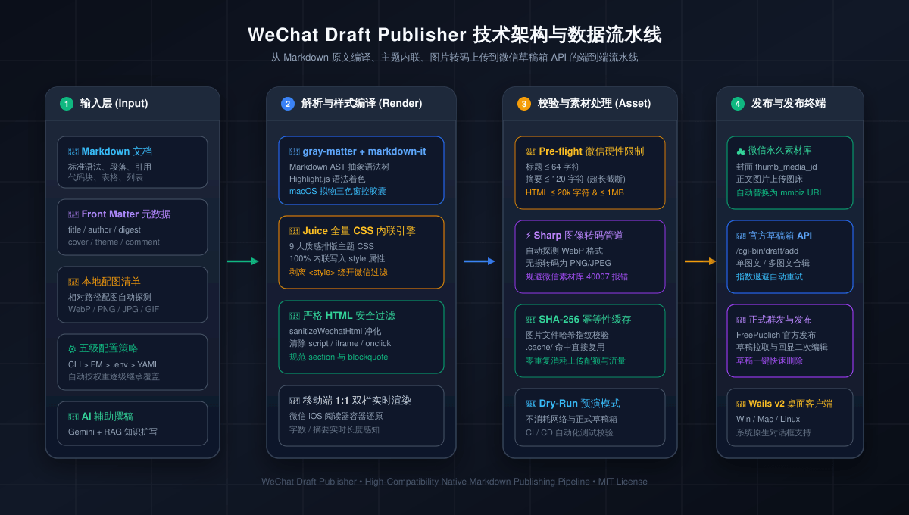

# 微信公众号草稿箱自动推送工具 (WeChat Draft Publisher)

<p align="center">
  
</p>

<p align="center">
  <b>Markdown 原文 + 本地配图 ➡️ 一键编译微信高兼容内联排版 ➡️ 永久素材库图片极速直传 ➡️ 微信草稿箱自动发布与多图文群发</b>
</p>

<p align="center">
  <a href="https://opensource.org/licenses/MIT"></a>
  <a href="https://github.com/sponsors"></a>
  
  
  
  
  
</p>

---

## 🌟 核心亮点

- ✍️ **实时双栏可视化工作台**：左侧 Markdown 编辑与 Front Matter 智能提取，右侧 1:1 还原真实 iPhone 微信公众号手机阅读外观。
- 🎨 **9 款高质感微信排版主题**：参考业内标杆排版规范，内置极客红、暖心橙、极客湛蓝、素雅黑白、青金石蓝等 9 套精美主题，支持一键独立开启/关闭主题排版。
- 🖼️ **全自动配图流水线**：自动解析 Markdown 中的相对路径配图，支持 PNG / JPG / GIF / WebP；**内置 Sharp 图像处理管道**，WebP 格式自动无损转码为微信素材库原生兼容格式，自带 SHA-256 哈希缓存去重，避免重复消耗上传流量。
- 🤖 **通用 AI 文章创作引擎 (Multi-LLM, Human-in-the-Loop)**：不是单一模型工具——内置 **DeepSeek / 通义千问 / Kimi (Moonshot) / OpenAI / 智谱 GLM / Gemini** 等主流大模型，并支持任意 OpenAI 兼容接口（**Ollama / 自建 vLLM / 中转**）自定义接入；可按受众与风格一键生成包含完整 Front Matter、严格符合微信规范的 Markdown 文章；支持导入本地参考文档（RAG 知识增强），所有 AI 内容仅作为草稿由作者最终审核，尊重创作者主导权。
- 📦 **草稿箱管理与多图文合辑 (Multi-Article)**：直连微信官方草稿箱接口，支持拉取查看历史草稿、一键回显到编辑器修改，并支持单条打包推送最多 8 篇多图文或直接触发微信 FreePublish 官方正式群发。
- 🛡️ **全方位微信规格前置校验 (Pre-flight Check)**：严格校验微信公众号技术指标（标题 ≤64 字、作者 ≤16 字、摘要 ≤120 字、正文 HTML ≤20,000 字符且 ≤1MB），在请求外部网络前即时阻断超标内容，贴心防坑。
- 💻 **双模高效运行**：既支持在浏览器中享受富交互可视化排版（Web），也提供极速命令行批处理工具（CLI），轻松接入 GitHub Actions、CI/CD 定时自动化发布流水线。

---

## 目录

- [一、快速从零上手指引](#一快速从零上手指引)
  - [1.1 准备环境与安装](#11-准备环境与安装)
  - [1.2 获取并配置微信公众号开发者凭据](#12-获取并配置微信公众号开发者凭据)
  - [1.3 启动 Web 可视化排版工作台](#13-启动-web-可视化排版工作台)
  - [1.4 写作与一键发布流程详解](#14-写作与一键发布流程详解)
- [二、核心功能全景介绍](#二核心功能全景介绍)
  - [2.1 九大内置排版主题与开关](#21-九大内置排版主题与开关)
  - [2.2 通用 AI 文章创作引擎（多模型支持）与本地资料导入](#22-通用-ai-文章创作引擎多模型支持与本地资料导入)
  - [2.3 草稿箱管理与多图文合并推送](#23-草稿箱管理与多图文合并推送)
  - [2.4 本地配图解析与 WebP 自动转码](#24-本地配图解析与-webp-自动转码)
- [三、命令行使用指南 (CLI)](#三命令行使用指南-cli)
- [四、Markdown 与 Front Matter 规范](#四markdown-与-front-matter-规范)
- [五、技术架构与五级配置机制](#五技术架构与五级配置机制)
- [六、Wails v2 桌面客户端打包与发布](#六wails-v2-桌面客户端打包与发布)
- [七、常见排错与微信官方错误码速查](#七常见排错与微信官方错误码速查)
- [八、赞助与打赏支持 (Sponsor)](#八赞助与打赏支持-sponsor)
- [九、开源协议 (License)](#九开源协议-license)

---

## 一、快速从零上手指引

### 1.1 准备环境与安装

本项目要求 **Node.js ≥ 18.0.0**，推荐使用 `pnpm` 进行依赖包管理（亦完全兼容 `npm`、`yarn`、`bun`）：

```bash
# 1. 克隆本仓库到本地
git clone https://github.com/andrewlaredo/wechat-draft-publisher.git
cd wechat-draft-publisher

# 2. 安装项目依赖 (推荐 pnpm)
pnpm install
```

### 1.2 获取并配置微信公众号开发者凭据

1. 登录 [微信公众平台 (mp.weixin.qq.com)](https://mp.weixin.qq.com/)；
2. 进入左侧菜单 **「设置与开发」** ➡️ **「基本配置」**：
   - 复制 **开发者ID (AppID)**；
   - 生成并保管好 **开发者密码 (AppSecret)**；
   - **至关重要的一步**：在 **「IP 白名单」** 设置中，将您运行本程序的机器的公网出口 IP 加入白名单（若在本地运行，可通过百度或 Google 搜索“我的 IP”查询）；
3. 配置凭据（以下两种方式任选一种）：
   - **方式一（Web 界面录入）**：直接启动程序后，在网页顶栏点击「凭据配置」直接输入保存；
   - **方式二（文件配置）**：复制环境变量文件并在 `.env` 中填写：
     ```bash
     cp .env.example .env
     ```
     编辑 `.env`：
     ```env
     WECHAT_APP_ID=wx1234567890abcdef
     WECHAT_APP_SECRET=0123456789abcdef0123456789abcdef
     ```

### 1.3 启动 Web 可视化排版工作台

执行以下命令即可启动可视化开发服务：

```bash
pnpm dev
```

终端将输出访问地址，打开浏览器访问：
```
http://localhost:3000
```

### 1.4 写作与一键发布流程详解

```
 ┌─────────────────┐       ┌─────────────────┐       ┌─────────────────┐
 │ 1. 左栏编写文章  │ ────> │ 2. 右栏实时预览  │ ────> │ 3. 一键推送发布  │
 │ Markdown + YAML │       │ 选主题/贴图/移动端│      │ 试运行 / 正式推送│
 └─────────────────┘       └─────────────────┘       └─────────────────┘
```

1. **选择模式与模板**：
   - 顶栏左侧可随时切换「图文长文」或「图片贴图（小绿书模式）」；
   - 下拉菜单可选择预置的多篇精选行业模板，快速上手；
2. **编辑正文与配图**：
   - 在左侧编写标准 Markdown，可使用工具栏快速插入标题、粗体、代码块或图片语法；
   - 在「文章元数据」面板中设定文章标题、作者名、摘要（自动防超 120 字截断）以及封面图路径；
3. **实时排版与主题调试**：
   - 在工具栏中选择心仪的排版主题（如极客红、极客湛蓝、暖纸人文等）；
   - 切换「Mac 风格代码」开关，代码块上方自动带有一体化红黄绿三色控制圆点；
   - 若您偏好原生黑白排版，可一键关闭「主题排版」总开关；
4. **一键发布**：
   - **试运行 (Dry-Run)**：建议首次发布前点击顶栏「试运行」，系统将在本地执行完整的渲染与参数校验，模拟草稿生成过程，不消耗任何微信接口配额；
   - **正式推送草稿箱**：点击「推送草稿箱」，系统自动将文章所有内嵌配图上传为微信永久素材，并以原作者身份直接创建官方草稿！发布成功后将返回草稿 `media_id`，您可直接登录微信公众号后台扫码预览或安排定时群发。

---

## 二、核心功能全景介绍

### 2.1 九大内置排版主题与开关

系统内置 9 种精心调试的微信公众号移动端高质感内联排版主题，严格遵循工业级内联转换标准：

| 主题 ID | 主题名称 | 风格特性 | 推荐适用场景 |
| :--- | :--- | :--- | :--- |
| **`pie`** | 极客红·探索 (默认) | 红色主调、呼吸感排版、亲和自然 | 科技生活、数码测评、综合资讯 |
| **`tech-blue`** | 极客湛蓝 | 科技湛蓝、深灰代码底色、Mac 圆点 | IT 技术、开源项目、技术深度解析 |
| **`orangeheart`** | 暖阳暖橙 | 明快轻快的温润橙红 | 运营通告、社群活动、年轻化内容 |
| **`lapis`** | 青金石蓝 | 稳重端庄的深青蓝、学术静谧 | 政企报道、学术札记、严谨研报 |
| **`phycat`** | 薄荷清新绿 | 清爽薄荷绿、护眼清爽 | 知识科普、医疗健康、极客日记 |
| **`medium`** | 素雅黑白 | 现代黑白灰质感、无衬线高级排版 | 商业分析、深度随笔、观点评论 |
| **`sakura`** | 浅绛绯红 | 典雅东方绯红美学、细腻柔美 | 文化艺术、美食摄影、情感生活 |
| **`warm-paper`** | 暖纸人文 | 仿古暖纸色调、琥珀赭石点缀 | 读书随笔、历史札记、人文散文 |
| **`default`** | 清新竹绿 | 原汁原味的经典微信生态绿 | 通用资讯、日常通知、官方公告 |

> 💡 **主题总开关**：点击工具栏的「主题排版: 开/关」，即可一键关闭装饰性色彩，回归最纯净的原生 Markdown 黑白间距排版。

### 2.2 通用 AI 文章创作引擎（多模型支持）与本地资料导入

点击顶栏「AI 智能撰文」即可打开强大的 AI 创作工作台。本项目内置**通用多模型 (Multi-LLM) 创作引擎**，而非绑定单一大模型：

| 预设模型 | 提供方 | 默认 Base URL | 默认模型 |
| :--- | :--- | :--- | :--- |
| **Gemini** | Google | `generativelanguage.googleapis.com` | `gemini-3.8-flash` |
| **DeepSeek** | 深度求索 | `api.deepseek.com/v1` | `deepseek-chat` |
| **OpenAI** | OpenAI | `api.openai.com/v1` | `gpt-4o-mini` |
| **通义千问 (Qwen)** | 阿里 DashScope | `dashscope.aliyuncs.com/compatible-mode/v1` | `qwen-plus` |
| **Kimi (Moonshot)** | 月之暗面 | `api.moonshot.cn/v1` | `moonshot-v1-8k` |
| **智谱 GLM (Zhipu)** | 智谱 AI | `open.bigmodel.cn/api/paas/v4` | `glm-4-flash` |
| **通用 OpenAI 兼容 (Custom)** | Ollama / vLLM / 中转 | 例如 `localhost:11434/v1` | 自定义（如 `qwen2.5:7b`） |

> 💡 任意提供方只需在弹窗中填入 **API Key + Base URL + 模型名** 即可即时切换，内置连通性测试；也可一键把本机 Ollama 接入本地免费推理。

- **受众偏好与文风定制**：支持科技专业、幽默风趣、深度分析、小白友好等多种行文风格选择；
- **小绿书贴图与图文长文双模构思**：自动输出带有规范 YAML Front Matter、重点分明的 Markdown 文章；
- **智能主题封面推荐**：基于文章核心关键词哈希种子，自动从精选高质量图库中匹配最契合的主题封面；
- **RAG 知识库与本地外部资料参考**：支持直接上传本地 `.md`、`.txt`、`.json`、`.csv` 作为背景参考资料，AI 将深度基于您给出的事实依据进行总结阐述；
- **创作者主导原则 (Human-in-the-Loop)**：AI 产出的内容仅作为待核验草稿载入左侧编辑器，系统绝不越权自动推送；若您已有自定义封面，AI 绝不会覆盖您的已有设定。

### 2.3 草稿箱管理与多图文合并推送

点击顶栏「草稿管理」可进入全功能草稿箱运维中心：
- **实时同步**：直连微信官方 `/cgi-bin/draft/batchget` 接口，拉取公众号现有未发布的草稿列表与文章详情；
- **一键载入**：点击任意草稿即可将其完整提取并回显至编辑器中进行二次润色；
- **多图文合辑 (Multi-Article)**：支持将最多 8 篇独立 Markdown 图文打包在一条微信图文消息中推送，支持自由上下拖拽调序、为每篇指定不同封面与排版主题；
- **正式群发 (FreePublish)**：支持对审核通过的草稿一键触发微信免审核群发接口，无需登录微信后台重复操作。

### 2.4 本地配图解析与 WebP 自动转码

- **无缝识别**：无论使用 Markdown 原生语法 `` 还是 HTML 标签 ``，系统均能精准定位并检查本地文件存在性；
- **WebP 格式无损转码**：微信公众平台素材库严禁直接上传 WebP 格式图片（会返回 `40007 / 40125` 错误）。工具底层使用高性能 `sharp` 库，在检测到 `.webp` 格式时自动无损转码为微信完美支持的 `.png`，彻底消除格式报错；
- **素材哈希指纹**：计算图片文件的 SHA-256 哈希值并持久化缓存至 `.cache/images.json`。相同图片多次引用仅上传一次，大幅节省网络带宽。

---

## 三、命令行使用指南 (CLI)

除了可视化 Web 界面，本项目还内置功能完整的独立 CLI 工具，非常适合配合 Shell 脚本或 CI/CD 自动部署：

```bash
# 基本语法
pnpm cli -- <markdown文件路径> [选项]
```

### 常用命令示例

```bash
# 1. 本地模拟运行 (Dry-Run，完全不访问微信网络)
pnpm cli -- ./posts/hello.md --dry-run

# 2. 真实推送到微信公众号草稿箱
pnpm cli -- ./posts/hello.md

# 3. 指定配图搜索目录与排版主题
pnpm cli -- ./posts/hello.md --images ./assets --theme tech-blue

# 4. 覆盖文章元数据 (标题、作者名与摘要)
pnpm cli -- ./posts/hello.md -t "2026 最新前沿趋势" -a "DeepTech" -d "深度解析本周技术突破"

# 5. 强制重新发布 (忽略已发布缓存检测)
pnpm cli -- ./posts/hello.md --force

# 6. 更新覆盖已存在的草稿 (指定微信 media_id)
pnpm cli -- ./posts/hello.md --draft-id "media_id_xxx"
```

### 命令行完整参数一览

```
选项:
  -i, --images <dir>        指定配图所在目录 (默认为 Markdown 文件所在目录)
  -c, --config <file>       指定自定义 YAML 配置文件路径 (默认 ./config.yaml)
  -e, --env <file>          指定环境变量凭证文件路径 (默认 ./.env)
  -t, --title <title>       覆盖文章标题 (限制 64 字符以内)
  -a, --author <author>     覆盖文章作者 (限制 16 字符以内)
  -d, --digest <digest>     覆盖文章摘要 (限制 120 字符以内，超长自动截断)
  --cover <path>            覆盖封面图片文件路径
  --thumb-media-id <id>     指定已存在的封面永久素材 ID (直接复用，免上传)
  --preview                 预览模式：处理排版并上传配图，但跳过草稿箱创建
  --dry-run                 本地模拟运行：完全不调用微信服务器网络接口
  --force                   忽略幂等性校验，强制生成新草稿
  --draft-id <id>           更新覆盖已有的指定 media_id 草稿
  --theme <name>            排版主题：pie / tech-blue / orangeheart / phycat / lapis / medium / sakura / warm-paper / default
  --verbose                 输出详细调试与请求日志
  -h, --help                查看帮助信息
  -v, --version             查看版本号
```

---

## 四、Markdown 与 Front Matter 规范

推荐在 Markdown 头部包含标准 YAML Front Matter 格式：

```markdown
---
title: 2026年微信公众号自动化发布全攻略
author: 探索者
digest: 探索如何使用 Markdown 快速排版并自动推送到微信公众号草稿箱。
cover: ./images/cover.png
thumb_media_id:
comment: true
theme: pie
code_theme: github
---
```

## 一、为什么选择 Markdown 写作？

Markdown 简洁专注，没有多余的富文本控制干扰，是广大技术写作者的首选。

### 代码高亮展示
```typescript
interface PublishResult {
  media_id: string;
  url?: string;
  is_dry_run: boolean;
}
```

### 配图方式
系统支持标准 Markdown 相对路径引用：



- **标题策略**：未声明 `title` 时，系统自动提取正文首个 `# 一级标题` 作为文章标题；
- **摘要规范**：微信接口硬性限制摘要不得超过 120 字符，超长内容系统将自动安全截断并记录日志；
- **字符硬限制**：单篇草稿正文 HTML 字符数必须 ≤ 20,000 且总体积 ≤ 1MB，工具内置 Pre-flight 机制自动监控与统计。

---

## 五、技术架构与五级配置机制

### 5.1 数据处理流水线

```
Markdown 文件 
  ➡️ gray-matter (提取 Front Matter 元数据)
  ➡️ markdown-it (语法树编译 + Highlight.js 代码着色 + Mac 窗口控件)
  ➡️ Juice (CSS 规则 100% 内联至每个 HTML 节点的 style 属性)
  ➡️ 微信规格前置拦截 (validateArticlePreflight: 标题/摘要/字数/图片校验)
  ➡️ 图片解析与 WebP 转码 (Sharp 处理管道 + 微信永久素材库上传)
  ➡️ SHA-256 幂等指纹计算 (.cache/ 缓存)
  ➡️ 微信草稿箱 API (/cgi-bin/draft/add)
```

### 5.2 五级配置合并策略

为了满足不同场景（单机开发、自动化 CI、生产容器部署），配置按照以下顺序自底向上覆盖：

```
1. 内置默认配置 (src/config.ts)
   ⬇️
2. YAML 配置文件 (config.yaml)
   ⬇️
3. 运行时配置缓存 (.cache/runtime-config.json)
   ⬇️
4. 系统环境变量 (.env / process.env)
   ⬇️
5. 命令行参数与 API 显式参数 (CLI Overrides)
```

### 5.3 核心代码模块结构

```
wechat-draft-publisher/
├── src/
│   ├── index.ts                 # CLI 命令行程序主入口 (Commander.js)
│   ├── cli.ts                   # 独立命令行执行脚本
│   ├── config.ts                # 五级配置优先级解析器与凭据校验
│   ├── pipeline.ts              # 核心发布前置校验与四步处理管线编排
│   ├── wechat/
│   │   ├── auth.ts              # access_token 获取、本地缓存与续期管理
│   │   ├── material.ts          # 图片上传微信永久素材库 (multipart/form-data)
│   │   └── draft.ts             # 草稿创建 (draft/add)、更新与批量查询
│   ├── markdown/
│   │   ├── parser.ts            # YAML Front Matter 元数据与正文解析
│   │   ├── renderer.ts          # MarkdownIt 语法高亮与 Mac 窗口控件渲染
│   │   └── style.ts             # 9 套主题样式与 Juice 全量内联转换引擎
│   ├── image/
│   │   ├── resolver.ts          # 本地相对路径图片定位与存在性校验
│   │   └── uploader.ts          # 并发上传、WebP 自动转码与 mmbiz URL 替换
│   ├── ai/
│   │   └── generator.ts         # Gemini AI 智能撰文与 RAG 本地资料学习
│   └── utils/
│       ├── hash.ts              # SHA-256 幂等性哈希计算与发布历史
│       ├── retry.ts             # 网络超时与微信服务异常指数退避重试
│       ├── wails.ts             # Wails 桌面端原生文件对话框与系统能力桥接
│       └── logger.ts            # 控制台日志高亮与错误追踪
├── build/                       # Wails 桌面打包资源 (图标、Windows 清单与 macOS Plist)
├── wails.json                   # Wails v2 客户端工程配置
├── main.go                      # Wails 桌面宿主启动入口与反向代理
├── app.go                       # Wails 桌面端原生系统文件/窗口/提示能力绑定
├── scripts/build-desktop.sh     # 桌面端一键编译打包脚本
├── .github/workflows/           # GitHub Actions 跨平台桌面端自动发布工作流
├── public/                      # 静态资源 (Logo、网站图标、赞赏码)
├── config.example.yaml          # YAML 配置文件模版
├── .env.example                 # 环境变量凭证示例模版
├── tests/                       # Vitest 单元测试用例套件
├── server.ts                    # Web 可视化工作台 Express 后端与 Vite 中间件
└── LICENSE                      # MIT 开源许可证
```

---

## 六、Wails v2 桌面客户端打包与发布

本项目已深度集成 **Wails v2 (Go + Webkit/WebView2)** 桌面应用架构。不仅保留了极速现代的 Web 排版体验，更获得了原生操作系统的文件对话框、文件读写权限以及极致的系统级内存与性能表现。

### 6.1 本地打包环境要求

1. **Go 语言环境**：[Go 1.20 或更高版本](https://go.dev/dl/)
2. **Node.js**：Node.js ≥ 18.0.0
3. **平台原生依赖**：
   - **Windows**：系统已内置 WebView2 Runtime (Windows 10/11 均已预装)
   - **macOS**：系统自带 WebKit，需安装 Xcode Command Line Tools (`xcode-select --install`)
   - **Linux**：`sudo apt-get install libgtk-3-dev libwebkit2gtk-4.0-dev`

### 6.2 快速编译与运行桌面端

安装 Wails v2 命令行工具：
```bash
go install github.com/wailsapp/wails/v2/cmd/wails@latest
```

使用内置命令：
```bash
# 1. 桌面端热重载开发模式
npm run wails:dev

# 2. 一键编译当前操作系统原生桌面端应用
npm run wails:build

# 3. 指定平台交叉打包
npm run wails:build:windows   # 生成 Windows .exe / NSIS 安装包
npm run wails:build:darwin    # 生成 macOS 通用二进制 (.app)
npm run wails:build:linux     # 生成 Linux 可执行文件

# 或直接使用一键打包脚本：
./scripts/build-desktop.sh windows
./scripts/build-desktop.sh mac
```

编译产物将自动输出到 `build/bin/` 目录下。

### 6.3 GitHub Actions 自动打包发布多平台 Release

仓库已配置完整的自动化流水线 (`.github/workflows/wails-release.yml`)。当您准备好发布新版本时，只需在本地为 Git 提交打上版本标签并推送到 GitHub：

```bash
git tag v1.0.0
git push origin v1.0.0
```

GitHub Actions 将自动并行启动 Windows、macOS 与 Linux Runner，交叉编译生成全平台安装包，并自动创建 GitHub Release 附带全部编译产物，供用户直接下载解压安装使用！

---

## 七、常见排错与微信官方错误码速查

| 微信错误码 | 错误信息描述 | 常见成因与排查解决方案 |
| :--- | :--- | :--- |
| **`40164`** | `invalid ip [...] not in whitelist` | **最常见错误**：当前机器公网 IP 未加入微信后台白名单。请前往 [微信公众平台] ➡️「设置与开发」➡️「基本配置」➡️「IP 白名单」添加报错中列出的 IP 地址。 |
| **`40001`** | `invalid credential, access_token is invalid` | AppSecret 配置错误，或 access_token 在其他服务中被重复刷新覆盖。系统已内置自动清缓存并单次重试机制。 |
| **`40013`** | `invalid appid` | 请检查 `.env` 或配置中的 `WECHAT_APP_ID` 是否包含多余空格或拼写有误。 |
| **`40007`** | `invalid media_id` | 封面图 ID 不存在或已过期。通常通过重新上传封面图即可解决。 |
| **`45166`** | `content contains invalid url / sensitive word` | 文章中含有外部非法链接或微信限制的标签（如 script、iframe），或触碰敏感词风控。 |
| **`45009`** | `reach max api daily quota limit` | 微信公众号接口调用次数已达单日调用上限，请等待次日自动重置。 |

### 微信公众号排版硬性限制备忘

1. **图文字符与体积上限**：单篇草稿正文 HTML 必须小于 20,000 字符且小于 1MB。本工具内置前置校验（Pre-flight Check），在发起上传前预先阻断超标内容并给出准确字数提示，避免浪费上传流量与接口调用频次。
2. **外链过滤机制**：普通订阅号正文中的外部 `<a href="...">` 链接会被微信自动屏蔽，微信仅支持微信生态内链接或在文末使用「阅读原文」。
3. **图片外链屏蔽**：直接引用外部非微信 CDN 图片将无法在公众号内显示，本工具会自动将 Markdown 中的本地图片上传至微信永久素材库并替换为 `mmbiz.qpic.cn` 地址。
4. **安全过滤**：所有 `<script>`、`<style>`、`<iframe>` 以及 `onclick` 等事件属性在上传草稿时均会被微信安全拦截，系统会在内联渲染时自动做严格的合规净化。

---

## 八、赞助与打赏支持 (Sponsor)

如果您觉得 **WeChat Draft Publisher** 提升了您的公众号创作排版与发布效率，欢迎为作者赞助一杯咖啡，支持项目的持续维护与更新！

### 1. 微信支付赞赏

使用微信「扫一扫」直接赞赏支持：

<p align="center">
  
</p>

> 💖 感谢每一位支持与认可本项目的伙伴！

---

## 九、开源协议 (License)

本项目基于 **[MIT License](./LICENSE)** 开源协议发布，您可以自由地用于个人创作、商业项目或二次开发扩展。
